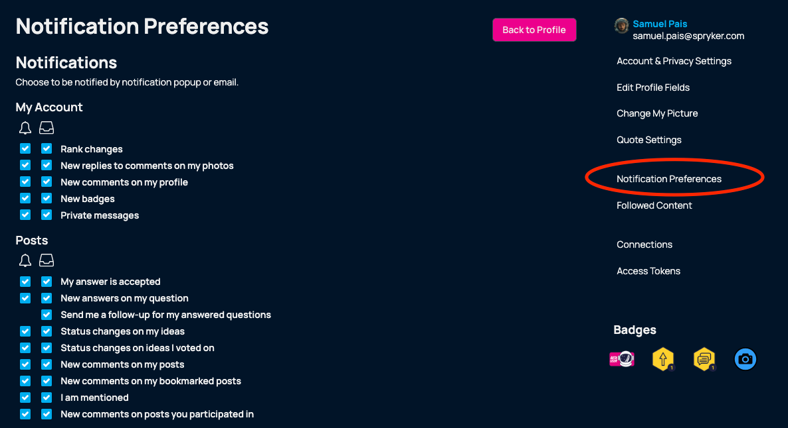

import { Image } from 'astro:assets';
import rocket from '../images/personal-rank.webp';

# CommerceQuest's Crew System aka Reactions 👍🏻, Badges 🎖, Ranks 🧑🏻‍🚀 and more

**TL;DR:**
* Reactions you get for your postings grant points.
* Hitting defined thresholds of a number of reactions grant you badges.
* In addition, there will be special badges for special activities, milestones, etc.
* Badges grant points too.
* Points are one of the major currencies to rank up the ladder and get additional capabilities to operate in our community.

Hi everybody, this is your crew member Sam speaking.

In this post, we provide you with a quick overview of our crew system also known as the mechanics of reactions, badges, and ranks in our community.

## Reactions
Each member can "react" to posts & discussions of other members with a variety of "reactions".
The following reactions are available to our members:
Insightful - granting 1 point to the userVote up - granting 1 point to the userVote down - no negative implications on the user

## Badges
Badges provide a testament to your meaningful contribution to our community. There's a variety of badges you can obtain throughout your journey. 
Badges can have multiple levels, meaning you can get the "Insightful" badge level 1 for receiving 5 "insightful" reactions, whereas level 10 of the badge will require 10,000 of the reactions. 
It's worth checking in occasionally, as we will roll out more ways to obtain special badges based on activity, challenges, and more.

## Ranks
With our rank ladder, we aim to provide more freedom and the ability to shape the community to the most engaged and committed members among us. 
There are at the moment 5 ranks in our community. Fulfill the requirements to get your promotion to the next rank. 
### Rank 1 - Nebula Cadet 🧑🏻‍🚀
Requirements:
* none 😄

Each member starts at this rank.
### Rank 2 - Astro Novice ✨
Requirements:
* 50 points
* 5 posts

You're editing window has been extended to 1h upon posting.
### Rank 3 - Omega Explorer 🪐
Requirements:
* 100 points
* 20 posts
* Member for at least 1 month

This rank will grant you access to run polls among our community.
### Rank 4 - Centauri Pioneer 🚀
Requirements:
* 500 points
* 50 posts
* Member for at least 3 months

Upon promotion, you can add a signature to your profile.
### Rank 5 - Nova Titan 🛡
Requirements:
* 1000 points
* 70 posts
* Member for at least 6 months

This is the highest rank in our current crew system. The council and tribunal will agree on your capability to co-moderate our community.

***Pro Tip***

Go into your personal setting of your profile and update your notification preferences to be notified once you climb up the rank ladder!

This is our first version of the crew system. We will gradually add more exciting elements to it. Let us know in the comments what you would be hyped about. 

Enjoy your journey.

Sam
